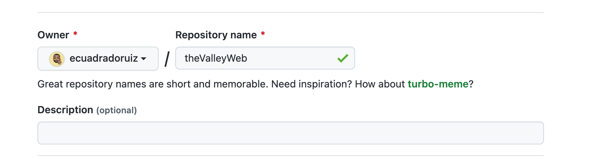

Vamos ahora a subir nuestro ejercicio de la sesión anterior, la web de TheValley.

Antes de crear el repositorio en GitHub vamos a nuestra carpeta del proyecto e indicamos que vamos a trabajar con git:

  

```bash
git init
```

  

Verificamos que está todo correcto, en nuestro caso no teníamos en el repositorio local los archivos por lo que tuvimos que comitearlos:

  

```bash
git status
git add index.html
git add img/
git status
git commit -m 'Initial commit'
```

  

Para ello tendremos que ir a GitHub y crear un repositorio.




Posteriormente seguir las instrucciones:

  

```bash
git remote add origin [git@github.com](mailto:git@github.com):ecuadradoruiz/webTheValley.git
git branch -M main
git push -u origin main
```

  

¡Y con esto ya lo tendríamos!

Si queremos ir un poco más allá, podemos crear el fichero .gitignore para ocultar todos aquellos ficheros que no queremos que aparezcan, como es el caso del ‘.DS_Store’ que aparece en el video y que se trata de un archivo de mac. Creamos el fichero

  

```bash
touch .gitignore
// añadimos .DS_Store dentro de él
git status
git add .gitignore
git commit -m 'nuevo fichero .gitignore'
git push
git status
```

  

Y con esto ya habríamos acabado nuestro ejercicio
