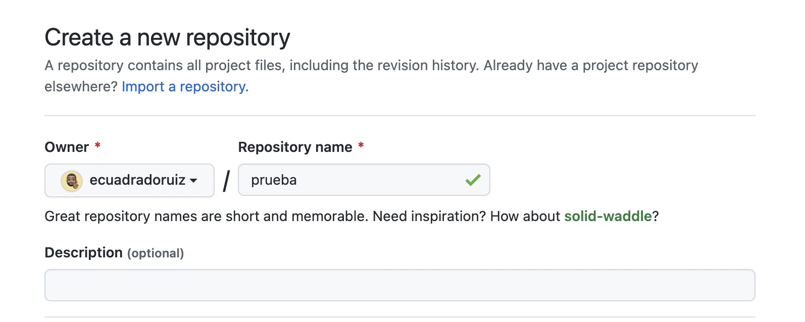
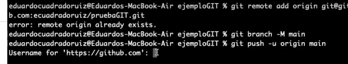
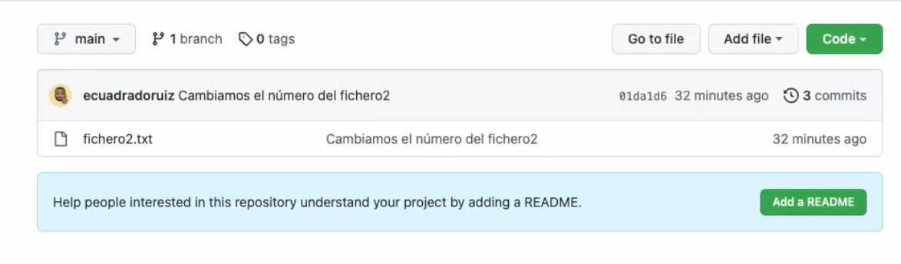

**CREAR REPOSITORIO**

Vamos a configurar ahora nuestro repositorio remoto en GitHub. En la página principal le damos a crear nuevo repositorio.


Introducimos el nombre y creamos el nuevo repositorio:




Para configurar el repositorio lo tenemos fácil ya que tenemos creada nuestra clave ssh.

Como ya tenemos un proyecto creado, seguimos las instrucciones que nos dicen.

```bash
git remote add origin [git@github.com](mailto:git@github.com):ecuadradoruiz/pruebaGIT.git
git branch -M main
git push -u origin main
```



Nos pide la contraseña de GitHub, para conseguirla vamos a GitHub y profile/settings → personal access tokens. Vamos a crear un token para poder acceder al repositorio.

Creamos uno que nos valga sobre todo.


Copiamos el token, lo introducimos y ya tendríamos subido a GitHub nuestro proyecto.

Lo comprobamos:



Seguiríamos a partir de ahora trabajando de la misma manera, únicamente nos quedaría hacer un git push para subir los commits que fuésemos teniendo en local.

Para traernos los cambios del repositorio tendríamos que utilizar el git pull (nos trae los cambios del servidor)

**GIT CLONE**

Vamos a aprender el git clone que nos va a permitir hacernos copias de un proyecto.

Copiamos el repositorio y trabajamos por comandos:


Nos pide la contraseña que configuramos ssh y tras dar enter nos descarga el proyecto.

A partir de aquí podemos trabajar como un nuevo desarrollador.

Con el comando git log podemos ver el log de todo lo que hemos ido haciendo.
